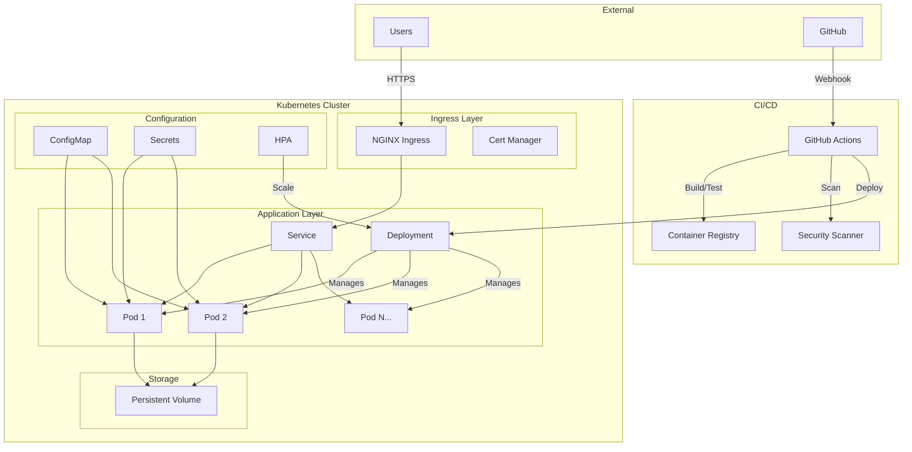
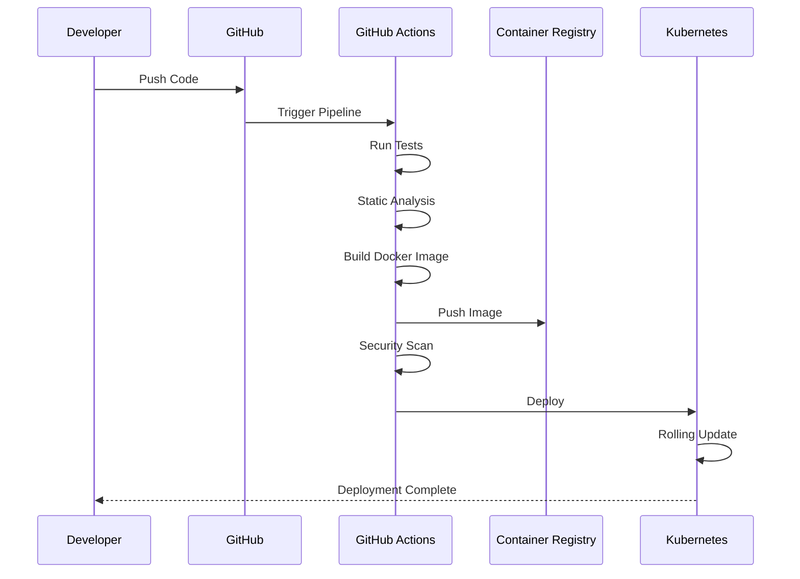
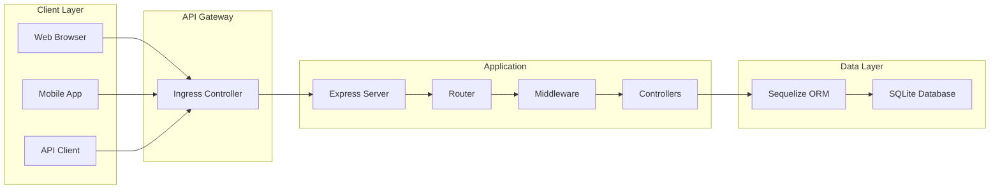
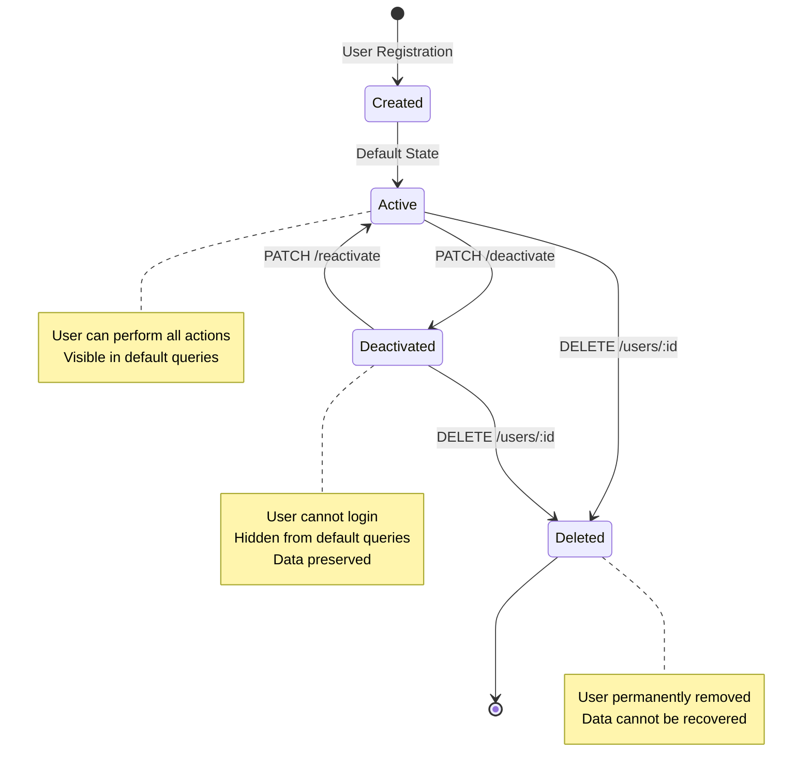
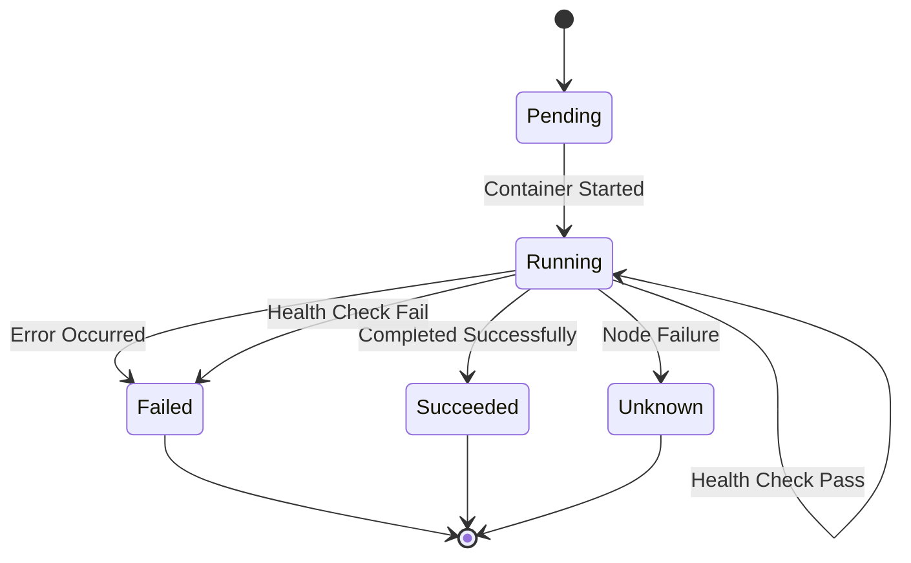
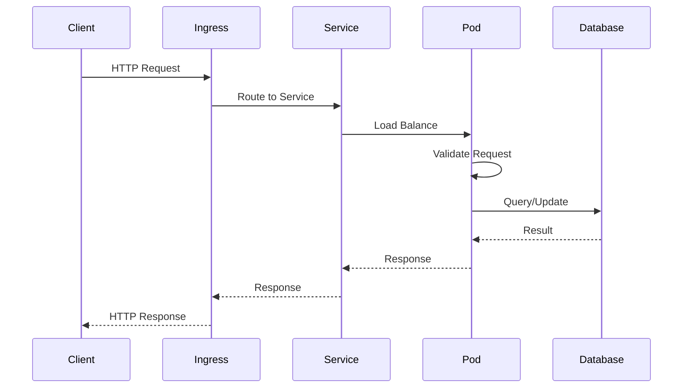

# Architecture Diagrams

## System Architecture

```mermaid
graph TB
    subgraph "External"
        U[Users]
        GH[GitHub]
    end
    
    subgraph "CI/CD"
        GA[GitHub Actions]
        REG[Container Registry]
        SCAN[Security Scanner]
    end
    
    subgraph "Kubernetes Cluster"
        subgraph "Ingress Layer"
            ING[NGINX Ingress]
            CERT[Cert Manager]
        end
        
        subgraph "Application Layer"
            SVC[Service]
            DEP[Deployment]
            POD1[Pod 1]
            POD2[Pod 2]
            PODN[Pod N...]
        end
        
        subgraph "Configuration"
            CM[ConfigMap]
            SEC[Secrets]
            HPA[HPA]
        end
        
        subgraph "Storage"
            PV[Persistent Volume]
        end
    end
    
    U -->|HTTPS| ING
    GH -->|Webhook| GA
    GA -->|Build/Test| REG
    GA -->|Scan| SCAN
    GA -->|Deploy| DEP
    
    ING --> SVC
    SVC --> POD1
    SVC --> POD2
    SVC --> PODN
    
    CM --> POD1
    CM --> POD2
    SEC --> POD1
    SEC --> POD2
    
    HPA -->|Scale| DEP
    DEP -->|Manages| POD1
    DEP -->|Manages| POD2
    DEP -->|Manages| PODN
    
    POD1 --> PV
    POD2 --> PV
```

## CI/CD Pipeline Flow

```mermaid
sequenceDiagram
    participant Dev as Developer
    participant GH as GitHub
    participant GA as GitHub Actions
    participant REG as Container Registry
    participant K8S as Kubernetes
    
    Dev->>GH: Push Code
    GH->>GA: Trigger Pipeline
    GA->>GA: Run Tests
    GA->>GA: Static Analysis
    GA->>GA: Build Docker Image
    GA->>REG: Push Image
    GA->>GA: Security Scan
    GA->>K8S: Deploy
    K8S->>K8S: Rolling Update
    K8S-->>Dev: Deployment Complete
```

## API Architecture

```mermaid
graph LR
    subgraph "Client Layer"
        WEB[Web Browser]
        MOB[Mobile App]
        API[API Client]
    end
    
    subgraph "API Gateway"
        ING[Ingress Controller]
    end
    
    subgraph "Application"
        EXP[Express Server]
        RTR[Router]
        MID[Middleware]
        CTL[Controllers]
    end
    
    subgraph "Data Layer"
        SEQ[Sequelize ORM]
        SQL[SQLite Database]
    end
    
    WEB --> ING
    MOB --> ING
    API --> ING
    
    ING --> EXP
    EXP --> RTR
    RTR --> MID
    MID --> CTL
    CTL --> SEQ
    SEQ --> SQL
```

## User State Diagram

```mermaid
stateDiagram-v2
    [*] --> Created: User Registration
    Created --> Active: Default State
    Active --> Deactivated: PATCH /deactivate
    Deactivated --> Active: PATCH /reactivate
    Active --> Deleted: DELETE /users/:id
    Deactivated --> Deleted: DELETE /users/:id
    Deleted --> [*]
    
    note right of Active
        User can perform all actions
        Visible in default queries
    end note
    
    note right of Deactivated
        User cannot login
        Hidden from default queries
        Data preserved
    end note
    
    note right of Deleted
        User permanently removed
        Data cannot be recovered
    end note
```

## Pod Lifecycle

```mermaid
stateDiagram-v2
    [*] --> Pending
    Pending --> Running: Container Started
    Running --> Succeeded: Completed Successfully
    Running --> Failed: Error Occurred
    Running --> Unknown: Node Failure
    Failed --> [*]
    Succeeded --> [*]
    Unknown --> [*]
    
    Running --> Running: Health Check Pass
    Running --> Failed: Health Check Fail
```

## Request Flow

```mermaid
sequenceDiagram
    participant C as Client
    participant I as Ingress
    participant S as Service
    participant P as Pod
    participant D as Database
    
    C->>I: HTTP Request
    I->>S: Route to Service
    S->>P: Load Balance
    P->>P: Validate Request
    P->>D: Query/Update
    D-->>P: Result
    P-->>S: Response
    S-->>I: Response
    I-->>C: HTTP Response
```